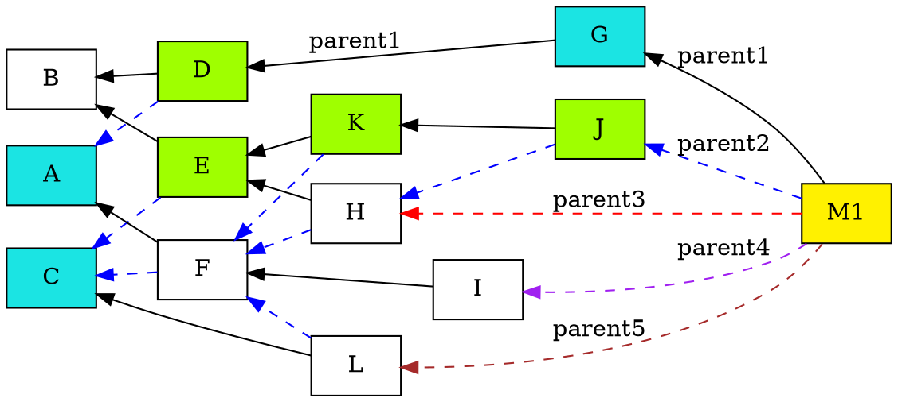

+ Feature name: `selective-permanode`
+ Start date: 2021-07-19
+ RFC PR: [iotaledger/chronicle-rfcs#xx](https://github.com/iotaledger/chronicle.rs-rfcs/pull/xx)
+ Chronicle Issue:  [iotaledger/chronicle.rs#102](https://github.com/iotaledger/chronicle.rs/issues/102)

# Summary

An abstraction for the scalable selective permanode feature for Chrysalis PH2, which enables users to select which messages should be stored in the permanode.

# Motivation

The number of messages in tangle is huge and keeps increasing. For different user applications, not all data in tangle are needed and should be kept. To reduce the maintenance cost, power consumption, as well as storage capacity, it is essential to enable users to **select** which messages should be persisted in Chronicle and which should not, where we called it **selective-permanode**.

Note that, the sub tangle constructed by selective permanode does not have to preserve path(s) between user interested data for confirmation tracing purpose. To trace the confirmation flow, the only path(s) needed to be kept in the selective-permanode is from an interested message to its corresponding **closest** and **newer** milestone message, because the paths between milestones must exist in IOTA Chrysalis PH2 protocol. For confirmation path tracing, it is no need to consume extra computing power nor waste storage capacity to store the paths between milestones if there are no interested message between them.

In summary, the **selective permanode** provides a more cost-effective way than **full permanode** (which preserves all the messages in the tangle). It enables user to store the interested messages only, for different purposes, but also enable the confirmation path tracing for user interested messages, without any other additional effort.

use cases:

1. Only persist specific data of the tangle in Chronicle and truncate/remove the unwanted ones.
2. Provide a more cost-effective way than `full permanode` for different purposes, without keeping/maintaining all the data.

# Current storage overhead of full permanode
- Around 2.6TB/year
    - Based on the information from https://chrysalis-dbfiles.iota.org/?prefix=chronicle/
    - Note the milestone period is 10 seconds.

# Selective Permanode Features
- User-defined messages to presist based on filtering
    - Each filter can AND/OR operation to another filter
    - Types of filters
        - **address filter**
            - Include or exclude addresses in a pre-defined set
        - **milestone filter**
            - Include or exclude milestones in a pre-defined set
        - **message_id filter**
            - Include or exclude message ids in a pre-defined set

- Selective tables to create
    - Note that the user cannot select which column (field) in the table to be stored
        - Otherwise the data model needs to be customized
    - Some API calls will return `None` if the corresponding table is not created

- Traceable selective message pathes
    - The messages which are in the linked solidification paths between selected messages should be kept
        - Those messages should be stored in the selective permanode in three different `Proof of Insertion` levels
            - **light proof**: Navigator points to the selected message
                - We only store the path from the milestone index and the linked parent position of the middle messages in the path
                - Need full permanode to verify the path
            - **hash proof**: hashes which point to the selected message
                - We store the message ids in the path from the milestone to the selected message
                - Need full permanode to verify the path
            - **full proof**: Full messages which point to the selected message
                - We store the full message in the path from the milestone to the selected message
                - The selective permanode is self-verifiable
    - Block definition
        - Selected message: the message to be selected to persist
        - Middle message: the message which is not selected but exists in the path between the milestone and the selected message, which should be also persisted to ease of message tracing
        - Milestone: the milestone message
    - The solidification process is depth first, the middle messages which exist in the path between the milestone message and the selected messages will be stored in selective permanode

- Example
    - In the following example, messages A, C, G will be stored with full information
    - Messages D, E, K and J will be persisted in the [messages table](#messages)
        - For **light proof** level
            - For message A
                - (Milestone index of M1, parent1 position of G, parent1 position of D) in `proof` column in the [message table](#messages)
                    - (1, 1, 1) in data type `<1u32,1u8,1u8>`
            - For message C
                - (Milestone index of M1, parent1 position of J, parent1 position of K, parent2 position of E) in `proof` column in the [message table](#messages)
                    - (1, 1, 1, 2) in data type `<1u32,1u8,1u8,1u8>`
            - For message G
                - (Milestone index of M1) in `proof` column in the [message table](#messages)
                    - (1) in data type `<1u32>`

        - For **hash proof** level
            - For message A
                - hash of M1 -> hash of G -> hash of D in `proof` column in the [message table](#messages)
            - For message C
                - hash of M1 -> hash of J -> hash of K -> hash of E in `proof` column in the [message table](#messages)
            - For message G
                - hash of M1 in `proof` column in the [message table](#messages)

        - For **full proof** level
            - Option 1
                - Full messages of middle messages D/E/K/J will be persisted
                    - Store the parent information of them in the (parents table)[#parents]
                    - Store the message information of them in the (messages table)[#messages]
                - For message A
                    - hash of M1 -> hash of G -> hash of D in `proof` column in the [message table](#messages)
                - For message C
                    - hash of M1 -> hash of J -> hash of K -> hash of E in `proof` column in the [message table](#messages)
                - For message G
                    - hash of M1 in `proof` column in the [message table](#messages)
            - Option 2
                - For message A
                    - full message of M1 -> full message of G -> full message of D in `proof` column in the [message table](#messages)
                - For message C
                    - Full message of M1 -> full message of J -> full message of K -> full message of E in `proof` column in the [message table](#messages)
                - For message G
                    - Full message of M1 in `proof` column in the [message table](#messages)
        - Milestone M1 will be stored with full information

- Solidifiable/Verifiable selective messages
    - The solidification process in a selective permanode is exactly the same as a full permanode
        - Note that the solidification process is performed in caches
    - In selective permanode, we will select the interested messages and then store them to the database

# Table list
- The following tables follow the same data model design of current [full permanode](#https://github.com/iotaledger/chronicle.rs/blob/a5bbd5f04ef31b518b3567bc818fff9bc994ba73/chronicle/src/main.rs#L171-L253) with extra `proof` column in the [message table](#messages)

## messages
- Primary key: message_id

| Column     | Data type |
| ---------- | --------- |
| message_id | text      |
| message    | blob      |
| metadata   | blob      |
| proof      | blob      |

## addresses
  - Primary key: (address, partition_id)

| Column          | Data type |
| --------------- | --------- |
| address         | text      |
| partition_id    | smallint  |
| milestone_index | int       |
| output_type     | tinyint   |
| transaction_id  | text      |
| idx             | smallint  |
| amount          | bigint    |
| address_type    | tinyint   |
| inclusion_state | blob      |

## indexes
- Primary key: (indexation, partition_id)

| Column          | Data type |
| --------------- | --------- |
| indexation      | text      |
| partition_id    | smallint  |
| milestone_index | int       |
| message_id      | text      |
| inclusion_state | blob      |
  - Primary key: (indexation, partition_id)

## parents
- Primary key: (parent_id, partition_id)

| Column          | Data type |
| --------------- | --------- |
| parent_id       | text      |
| partition_id    | smallint  |
| milestone_index | int       |
| message_id      | text      |
| inclusion_state | blob      |

## transactions
- Primary key: transaction_id

| Column          | Data type |
| --------------- | --------- |
| transaction_id  | text      |
| idx             | smallint  |
| variant         | text      |
| message_id      | text      |
| data            | blob      |
| inclusion_state | blob      |
| milestone_index | int       |

## milestones
- Primary key: (milestone_index, message_id)

| Column          | Data type |
| --------------- | --------- |
| milestone_index | int       |
| message_id      | text      |
| timestamp       | bigint    |
| payload         | blob      |

## hints
- The hint variant can be `parent`, `address`, or `index`.
- Primary key: hint
 
| Column          | Data type |
| --------------- | --------- |
| hint            | text      |
| variant         | text      |
| partition_id    | smallint  |
| milestone_index | int       |

## sync
- Primary key: key
- Now it is fixed to be [text](https://docs.scylladb.com/getting-started/types/), `permanode`

| Column          | Data type |
| --------------- | --------- |
| key             | text      |
| milestone_index | int       |
| synced_by       | tinyint   |
| logged_by       | tinyint   |

## analytics
- Primary key: key
- Now it is fixed to be [text](https://docs.scylladb.com/getting-started/types/), `permanode`

| Column             | Data type |
| ------------------ | --------- |
| key                | text      |
| milestone_index    | int       |
| message_count      | int       |
| transaction_count  | int       |
| transferred_tokens | int       |

# Drawbacks

- If the there is no milestone or similar concepts in future IOTA protocol, then this selective permanode design needs to be changed.

# Rationale and alternatives

- Solidifier

# Limitations

- To solidify messages of a milestone, the queried IOTA nodes or permanodes need to contain the smallest full set of messages which are attached directly or indirectly by the milestone.

# Unsolved questions
- For **full proof** level, which option do we need to implement?
    - Option 1
        - Pros
            - Save the storage cost
        - Cons
            - Need to traverse the selective permanode to proof the selected messages
    - Option 2
        - Pros
            - Ease of tracing and verifying the selected messages
        - Cons
            - May consume lots of storage space if the number of middle messages (which might be repetitive) are many
- Do we force the user store the full path in the proof column, or we just store the full information of selected messages and the middle message in the [messages table](#messages) and [parents table](#parents)?
    - Pros
        - Save the storage cost
    - Cons
        - To trace a selected message will be time consuming