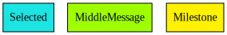
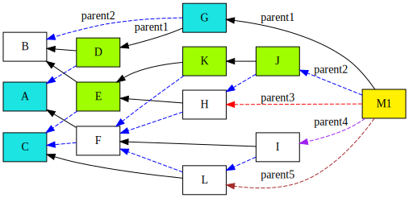

+ Feature name: `selective-permanode`
+ Start date: 2021-07-19
+ RFC PR: [iotaledger/chronicle-rfcs#0001](https://github.com/iotaledger/chronicle-rfcs/pull/1)
+ Chronicle issue:  [iotaledger/chronicle.rs#102](https://github.com/iotaledger/chronicle.rs/issues/102)
+ Author list
    + Louay Kamel (louay.kamel@iota.org)
    + Alexander Coats (alexander.coats@iota.org)
    + Bing-Yang Lin (bingyang.lin@iota.org)

# Summary

An abstraction for the scalable selective-permanode feature for Chrysalis PH2, which enables users to select which messages should be stored in the permanode.

# Pre-limitation

In a tangle, the solidification mechanism is essential to make sure all the messages in a sub tangle being collected. To solidify a sub tangle, the queried IOTA nodes or permanodes or the imported archive files need to contain the smallest full set of messages which are attached directly or indirectly by the global-trusted message.

Note that in a tangle with or without coordicide, the selective-permanode always needs to query other IOTA nodes or permanodes or import the historical archive files to get the missing data.

In Chrysalis PH2, the milestone, which is issued by IOTA coordinator, is used as a global-trusted message to solidify a sub tangle. In a coordicide tangle, it is still necessary to have a mechanism to solidify a sub tangle, or we cannot guarantee all of the messages are collected. This solidification mechanism will impact the design of the selective-permanode, because in the permanode we need to use the mechanism to make sure all of the selected messages in a given period of time are all collected. In the coordicide tangle, if we can define another kind of global-trusted messages (which should exist for solidification) between a given period of time, then the proposed design still holds.

# Motivation

The number of messages in tangle is huge and keeps increasing. For different user applications, not all data in tangle is necessary to keep. To reduce the maintenance cost, power consumption, as well as storage capacity, it is essential to enable users to **select** which messages should be persisted in Chronicle and which should not. This is called **selective-permanode**.

Note that the sub tangle constructed by selective-permanode does not have to preserve path(s) between user interested data for confirmation tracing purpose. To trace the confirmation flow, the only path(s) needed to be kept in the selective-permanode is from an interested message to its corresponding **closest referencing milestone message**, because the paths between milestones must exist in IOTA Chrysalis PH2 protocol. For confirmation path tracing, it is not necessary to consume extra computing power or waste storage capacity to store the paths between milestones if there are no interested message between them.

In summary, a **selective-permanode** provides a more cost-effective way than a **full-permanode** (which preserves all the messages in the tangle). It enables users to store only desired messages but also confirmation path tracing without any additional effort.

Use cases:

1. Only persist specific data of the tangle in Chronicle and truncate/remove the unwanted ones.
2. Provide a more cost-effective storage solution than a **full-permanode**.

# Current storage overhead of full-permanode
- Around 2.6TB/year
    - Based on the information from https://chrysalis-dbfiles.iota.org/?prefix=chronicle/
    - Note the milestone period is 10 seconds.

# Selective Permanode Features
- User-defined messages to persist based on filtering
    - Each filter can be combined via AND/OR with another filter
    - Types of filters (each can be used with a pre-defined set of data or function to include/exclude messages)
        - **address filter**
        - **milestone filter**
        - **message_id filter**
        - **indexation_key filter**
  
- API calls to prune the chronicle database
    - Each API call can be triggered manually by user when the permanode is running
    - API list (each can be used with a pre-defined set of data or function to remove messages)
        - **prune_address**
        - **prune_milestone**
        - **prune_message_id**
        - **prune_indexation_key**

- Selective tables to create
    - Note that the user cannot select which column (field) in the table to be stored
        - Otherwise the data model needs to be customized
    - Some API calls will return `None` if the corresponding table is not created

- Traceable selective message paths
    - This feature is to ease of tracing the selected message from a globally trusted message which is used to solidify the tangle
    - The messages which are in the linked solidification paths between selected messages should be kept
        - Those messages should be stored in the selective-permanode in three different **proof** levels
            - **light proof**: Navigator points to the selected message
                - We only store the path from the milestone index and the linked parent position of the middle messages in the path
                - We can trace the selected message from its closest referencing milestone by the navigators to prove the existence of the selected message
                - Need full-permanode or IOTA nodes which have the messages or historical archive files to verify the path
            - **hash proof**: Hashes which point to the selected message
                - We store the message ids in the path from the milestone to the selected message
                - We can trace the selected message from its closest referencing milestone by the linked hashes to prove the existence of the selected message
                - Need full-permanode or IOTA nodes which have the messages or historical archive files to verify the path
            - **full proof**: Full messages which point to the selected message
                - We store the full message in the path from the milestone to the selected message
                - We can trace the the selected message from its closest referencing milestone by the linked messages to prove the existence of the selected message
                - The selective-permanode is self-verifiable
    - Block definition
        - Selected message: the message to be selected to persist
        - Middle message: the message which is not selected but exists in the path between the milestone and the selected message, which should be also persisted to ease of message tracing
        - Milestone: the milestone message
    - The solidification process is depth first, the middle messages which exist in the path between the milestone message and the selected messages will be stored in selective-permanode

# Example
In the following example, messages A, C, G will be stored with full information

Messages D, E, K and J will be persisted in the [messages table](#messages)

### **Light proof**
`proof` column in the [message table](#messages) contains:
- Message A
    - Milestone index of M1 (`u32`)
    - parent position of G (`u8`)
    - parent position of D (`u8`)
- Message C
    - Milestone index of M1
    - parent position of J
    - parent position of K
    - parent position of E
- Message G
    - Milestone index of M1

### **Hash proof**
`proof` column in the [message table](#messages) contains:
- Message A
    - hash(M1)
    - hash(G)
    - hash(D)
- Message C
    - hash(M1)
    - hash(J)
    - hash(K)
    - hash(E)
- Message G
    - hash(M1)

### **Full proof**
Milestone M1 will be stored with full information

Full messages D, E, K, J will be persisted

#### Option 1
- Store the parent information for them in the [parents table](#parents)
- Store the message information for them in the [messages table](#messages)

`proof` column in the [message table](#messages) contains:
- Message A
    - hash(M1)
    - hash(G)
    - hash(D)
- For message C
    - hash(M1)
    - hash(J)
    - hash(K)
    - hash(E)
- For message G
    - hash(M1)

### Option 2
`proof` column in the [message table](#messages) contains:
- Message A
    - Full message of M1
    - Full message of G
    - Full message of D
- Message C
    - Full message of M1 
    - Full message of J
    - Full message of K
    - Full message of E
- Message G
    - Full message of M1

## Solidifiable/Verifiable selective messages
The solidification process in a selective-permanode is exactly the same as a full-permanode

Note that the solidification process is performed in caches

In selective-permanode, we will select the interested messages and then store them to the database

# Related table list
- The following tables follow the same data model design of current [full-permanode](#https://github.com/iotaledger/chronicle.rs/blob/a5bbd5f04ef31b518b3567bc818fff9bc994ba73/chronicle/src/main.rs#L171-L253) with extra `proof` column in the [message table](#messages)

## messages
- Primary key: message_id

| Column     | Data type |
| ---------- | --------- |
| message_id | text      |
| message    | blob      |
| metadata   | blob      |
| proof      | blob      |

## parents
- Primary key: (parent_id, partition_id)

| Column          | Data type |
| --------------- | --------- |
| parent_id       | text      |
| partition_id    | smallint  |
| milestone_index | int       |
| message_id      | text      |
| inclusion_state | blob      |

# Drawbacks

- If the there is no solidification process where we can define a kind of global-trusted messages periodically in future IOTA protocol, then this selective-permanode design needs to be changed according to the future protocol.

# Alternative design

In the following we introduce two kinds of alternative selective-permanode designs.

## Pre-limitations

In these two alternative designs, the solidification process is still essential to ensure all the selective messages are collected in a sub tangle. Also IOTA tokens are needed to execute the selective-permanode.

## Value-transaction-based design

### Description

The [tangleproof](https://github.com/Thoralf-M/tangleproof) proposed by Thoralf Müller uses the UTXOs to prove the existence of a message. For this selective-permanode design, each selected message, or a batch of selected messages (with predefined or adaptive number of messages), are necessary to be put in the payload of a value transaction. Then, the value transaction should be issued to a trusted IOTA node, and the selective-permanode needs to check whether the value transaction is already confirmed in the tangle.

#### Pros

- Suitable for both tangles with and without a coordinator.

#### Cons

- The user will need IOTA tokens to run a selective-permanode.
- The selective-permanode needs to issue massive redundancy value transactions for the selective messages if there are many.
- The selective-permanode needs to monitor whether the value transactions are already confirmed in the tangle, which means reattach/retry/promote are necessary if they are orphaned.
    - Will be more suitable to design it as a plugin in a IOTA node, so the incoming selected messages can be packed right away and be issued as a payload in a value transaction to itself (the IOTA node) with higher priority
- The value transactions (with selective message(s) as a payload) between the selective-permanodes with the same filtering settings cannot be shared, because each selective-permanode will issue their own value transaction (which is unique) for the same selective message. Thus, this selective-permanode design is not scalable (each selective-permanode will remain different sets of transaction messages as the proof of selected messages even if they aim to select the same set of messages).
- The issued value transactions (those with the selective messages as a payload) are necessary to be stored in the selective-permanode, which introduces the following problem: Another mechanism is needed to solidify those value transactions, or we cannot know if any of them is missing. We cannot include them in a payload of another transaction and issue it again, because this will introduce an infinite loop.
- If the selected messages are packed as a single payload, then the future pruning of these messages is impossible (because the messages were already packed and issued). The user will need to issue new packed selected messages again from the oldest date.
- If the selected messages are not packed, and each selected message is sent as a payload in a transaction one by one, then the number of transaction (which is only used to prove the sleeted message) grows linearly with the number of selected messages.

## ISCP-based design

### Description

An [ISCP](https://blog.iota.org/iota-smart-contracts-protocol-alpha-release/) chain is adopted to record the selective messages. A selective-permanode will send the data (contain the selected messages with the associated paths) to the ISCP chain directly. In this design, we leverage the self-verifiable characteristic of the smart contract. Also, the APIs provided in the ISCP chain can be leveraged to access the data.

### Pros

- Suitable for both tangles with and without a coordinator.

### Cons

- An additional ISCP chain is essential to running associated with the selective-permanode.
- The ISCP design is not completed yet.

# Unsolved questions
1. The naming of **light/hash/full proof** is proper and easy to understand? (solved)
  - We provide more description and explanation associated with their namings.
2. For **full proof** level, which option do we need to implement?
    - Option 1
        - Pros
            - Save the storage cost.
        - Cons
            - Need to traverse the selective-permanode to proof the selected messages.
    - Option 2
        - Pros
            - Ease of tracing and verifying the selected messages.
        - Cons
            - May consume lots of storage space if the number of middle messages (which might be repetitive) are many
3. Do we force the user store the full path in the proof column, or we just store the full information of selected messages and the middle message in the [messages table](#messages) and [parents table](#parents)?
    - Pros
        - Save the storage cost.
    - Cons
        - To trace a selected message will be time consuming.
4. Do we choose the alternative design to implement the selective-permanode?

# TODO

- Review people list and the expected deadline
- Doodle opinion voting for the design to implement